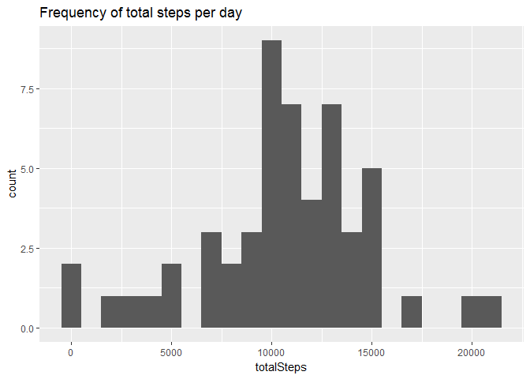
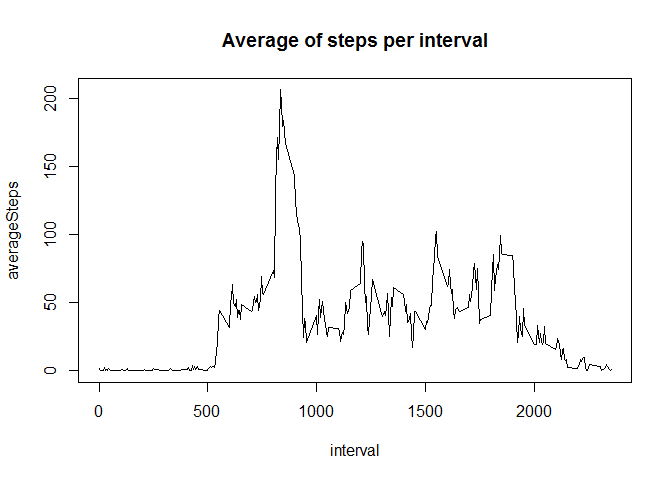
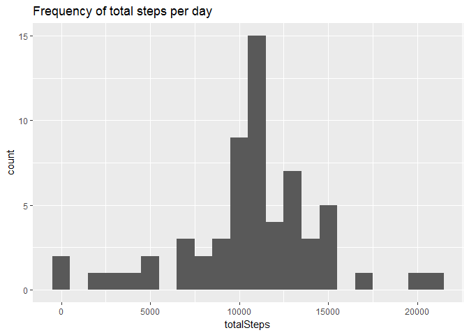
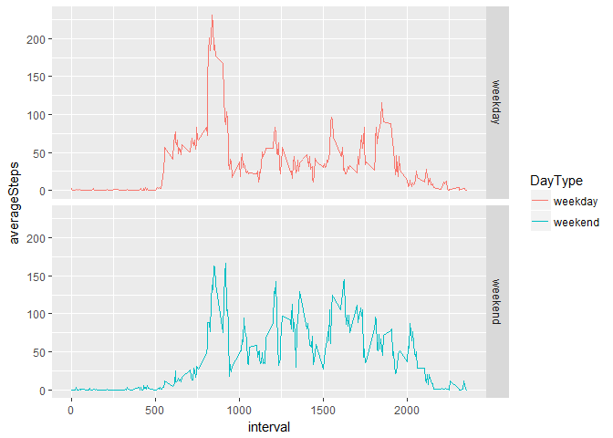

# Reproducible Research: Peer Assessment 1


## Loading and preprocessing the data
First, We load the data and then clean it by removing NA values and casting the date to a date class


```r
Fulldt <- read.csv("activity/activity.csv", stringsAsFactors = F)
dt <- Fulldt[complete.cases(Fulldt),]
dt$date <- as.Date(dt$date, format = "%Y-%m-%d")
```

## What is mean total number of steps taken per day?

Analysing the data by plotting a histogram of the ferquency of total steps taken per day

```r
library(dplyr,warn.conflicts =  F)
library(ggplot2)
stepsPerDay <- dt %>% group_by(date) %>% summarise(totalSteps = sum(steps))
qplot(totalSteps, data = stepsPerDay, geom = "histogram", main = "Frequency of total steps per day", binwidth = 1000)
```

<!-- -->

Calculating the mean and median of total steps per day

```r
avg <- mean(stepsPerDay$totalSteps)
med <- median(stepsPerDay$totalSteps)
```

The mean is 10766.1886792453 and the median is 10765.  

## What is the average daily activity pattern?

Analysing the average number of steps taken across the day


```r
stepsPerInterval <- dt %>% group_by(interval) %>% summarise(averageSteps = mean(steps))
plot(averageSteps~interval, data = stepsPerInterval, main = "Average of steps per interval", type = "l")
```

<!-- -->

Finding the interval with the maximum number of average steps


```r
MaxInt <- stepsPerInterval$interval[which.max(stepsPerInterval$averageSteps)]
```

The Interval with maximum number of average steps is 835.

## Imputing missing values

Calculating the total number of missing values.

```r
numberNA <- sum(is.na(Fulldt))
```

Imputing the values by replacing each missing value with the average for this interval


```r
for (counter in seq(nrow(Fulldt))){
  if (is.na(Fulldt[counter,"steps"])){
    Fulldt[counter,"steps"] <- stepsPerInterval$averageSteps[which(stepsPerInterval$interval == Fulldt[counter,"interval"])]
  }
}
Fulldt$date <- as.Date(Fulldt$date, format = "%Y-%m-%d")
```

Analyzing the imputed dataset:

Plotting the total number of steps per day

```r
library(dplyr,warn.conflicts =  F)
library(ggplot2)
stepsPerDayFull <- Fulldt %>% group_by(date) %>% summarise(totalSteps = sum(steps))
qplot(totalSteps, data = stepsPerDayFull, geom = "histogram", main = "Frequency of total steps per day", binwidth = 1000)
```

<!-- -->

Calculating the mean and median of total steps per day

```r
avgFull <- mean(stepsPerDayFull$totalSteps)
medFull <- median(stepsPerDayFull$totalSteps)
```
The new mean is 10766.1886792453 and the median is 1.0766189\times 10^{4}. Compare to mean = 1.0766189\times 10^{4} and  median = 10765 of the incomplete data.

## Are there differences in activity patterns between weekdays and weekends?

Creating a variable of day type whether weekend or weekday

```r
typeOfDay <- function(x) {if (weekdays(x) == "Saturday" | weekdays(x) == "Sunday") "weekend" else "weekday"}
Fulldt$DayType <- sapply(Fulldt$date, typeOfDay)
Fulldt$DayType <- as.factor(Fulldt$DayType) 
```

plotting the activitiy across weekends and weekdays

```r
stepsPerIntervalFull <- Fulldt %>% group_by(interval, DayType) %>% summarise(averageSteps = mean(steps))
g <- ggplot(aes(y= averageSteps,x = interval, color = DayType), data = stepsPerIntervalFull, main = "Average of steps per interval") 
g +  geom_line() + facet_grid(DayType~.)
```

<!-- -->
We can see that across weekdays there is more activity near the midday.
